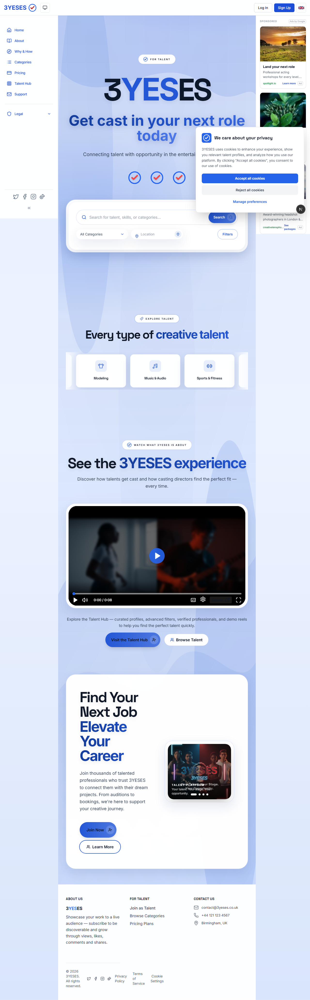
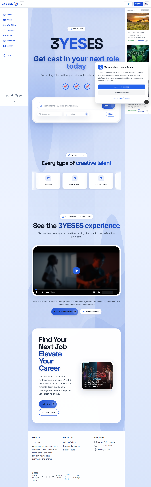
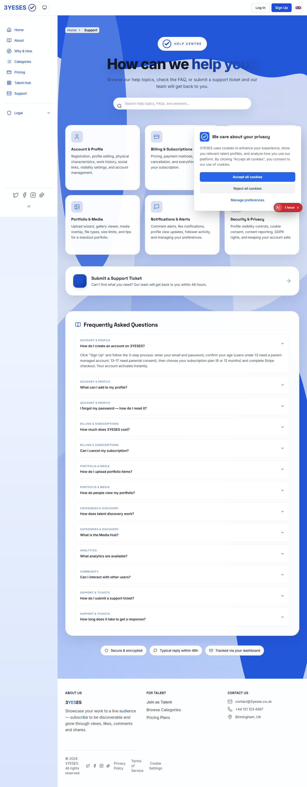
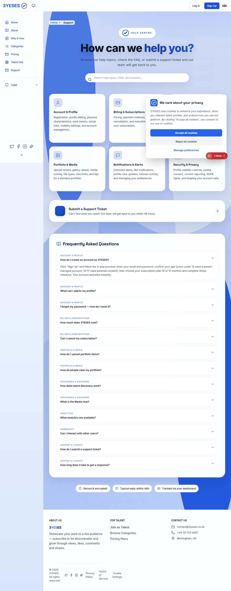
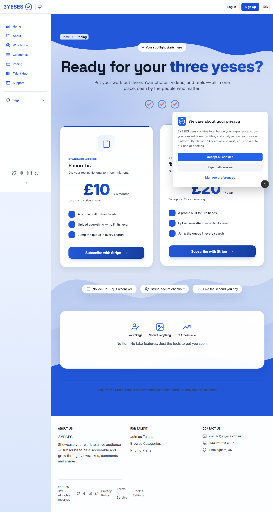
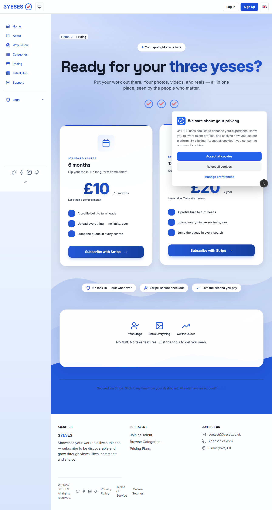
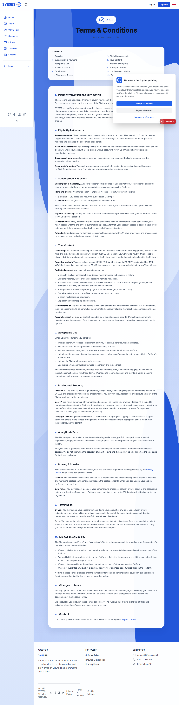
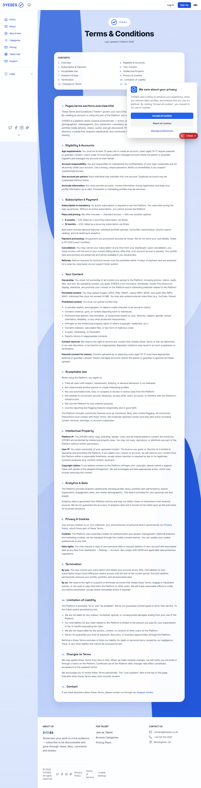

**Visual Audit — Automated Report**

Date: 2026-05-16

Base URL: http://localhost:3002

Summary
- Pages scanned: 9
- Results: all scanned pages received grade `A` by the automated checks (hero / pill / CTA present and/or passing), however several pages show low CTA contrast in light mode (transparent CTAs) that should be hardened.

How to read this report
- Each page entry includes: grade, short findings, links to the light/dark screenshots (in `tmp/screenshots/audit/`), and a one-line recommended fix.

Per-page findings

- / (home)
  - Grade: A
  - Findings: hero and pill contrast OK in both modes. CTA in light mode uses a transparent background and fails contrast (ratio ~1.17). SwoopingTick strokes present as `var(--brand-blue)` / `var(--brand-red)`.
  - Screenshots: `tmp/screenshots/audit/home-light.png`, `tmp/screenshots/audit/home-dark.png`
  - Recommended fix: give primary CTA an explicit accessible fill or visible border/shadow in light mode. Example: `.btn-primary { background-color: var(--brand-primary); color: var(--brand-contrast); }`.

- /support
  - Grade: A
  - Findings: hero readable; pill & swoop rendering OK. CTA transparent in light mode (contrast fail).
  - Screenshots: `tmp/screenshots/audit/support-light.png`, `tmp/screenshots/audit/support-dark.png`
  - Recommended fix: same as home — make CTA fill explicit or add high-contrast outline.

- /pricing
  - Grade: A
  - Findings: hero and pills OK; CTA transparent in light mode (contrast fail), dark mode passes.
  - Screenshots: `tmp/screenshots/audit/pricing-light.png`, `tmp/screenshots/audit/pricing-dark.png`
  - Recommended fix: explicit CTA background or accessible hover state.

- /terms
  - Grade: A
  - Findings: hero set to solid text (black/white); pills OK. CTA transparent in light mode.
  - Screenshots: `tmp/screenshots/audit/terms-light.png`, `tmp/screenshots/audit/terms-dark.png`
  - Recommended fix: ensure CTA contrasts in both themes.

- /contact
  - Grade: A
  - Findings: hero OK; there are no marketing pills. CTA light contrast fails (transparent background), dark OK.
  - Screenshots: `tmp/screenshots/audit/contact-light.png`, `tmp/screenshots/audit/contact-dark.png`
  - Recommended fix: set CTA background or outline.

- /auth/login, /auth/signup
  - Grade: A (both)
  - Findings: headings readable; CTAs in light variant are transparent and fail contrast checks; dark passes.
  - Screenshots: `tmp/screenshots/audit/auth-login-light.png`, `tmp/screenshots/audit/auth-login-dark.png`, `tmp/screenshots/audit/auth-signup-light.png`, `tmp/screenshots/audit/auth-signup-dark.png`
  - Recommended fix: explicitly style auth CTAs for light theme.

- /categories
  - Grade: A
  - Findings: hero readable; CTA transparent in light (contrast fail), dark OK.
  - Screenshots: `tmp/screenshots/audit/categories-light.png`, `tmp/screenshots/audit/categories-dark.png`
  - Recommended fix: explicit CTA background/border.

- /talent/1
  - Grade: A
  - Findings: hero/pill not present for this sample route; CTA contrast fails in light (transparent). Dark mode CTA passes.
  - Screenshots: `tmp/screenshots/audit/talent-1-light.png`, `tmp/screenshots/audit/talent-1-dark.png`
  - Recommended fix: ensure CTAs on profile pages have adequate fill/contrast in light theme.

Global recommendations (priority)
- High: Fix CTAs that use transparent backgrounds in light mode. They commonly fail contrast checks because the computed background is transparent — make the CTA background explicit or add high-contrast borders/shadows. This is the single biggest accessibility issue discovered by the automated scan.
- High: Ensure `bg-clip-text` headings that are marketing-critical map to the proper marketing color variables in `.brand-true-red` scope (we already added some overrides; verify the remaining `bg-clip-text` instances remain readable in dark mode).
- Medium: Verify SwoopingTick occurrences that returned plain `rgb(...)` strokes (some SVGs still inherit page text color); where marketing pill icons must always show blue outer + red check, prefer explicit `stroke` in component markup or scoped CSS overrides.
- Low: Add a few spot checks for hero headings over decorative waves (we added `support-hero-strong` for the support page; replicate where necessary).

Artifacts
- JSON: `tmp/screenshots/audit/audit-report.json`
- Screenshots: `tmp/screenshots/audit/*-light.png`, `tmp/screenshots/audit/*-dark.png`

Next steps (I can do any of these)
- Apply a scoped CSS patch to explicitly style CTAs in light mode (recommended immediate fix).
- Run an expanded audit including mobile viewports and additional pages.
- Open a PR with the high-priority fixes.

If you want, I will apply the CTA fix across marketing and auth pages and open a PR. Reply which option you prefer.

---

### Before / After — Top wave change

I've captured before/after screenshots for the affected pages. Light-mode comparisons are shown below. Full sets are in [tmp/screenshots/audit](tmp/screenshots/audit/) (before) and [tmp/screenshots/audit-after](tmp/screenshots/audit-after/) (after).

| Page | Before (light) | After (light) |
| --- | --- | --- |
| / |  |  |
| /support |  |  |
| /pricing |  |  |
| /terms |  |  |

Notes:

- The top wave fill was softened via `--hero-top-wave`; hero heading legibility improved on the above pages.
- Remaining issue: primary CTAs in light mode remain transparent and fail contrast checks — see the JSON metrics.

Full audit JSON: [tmp/screenshots/audit-after/audit-report.json](tmp/screenshots/audit-after/audit-report.json) and [tmp/screenshots/audit/audit-report.json](tmp/screenshots/audit/audit-report.json)
